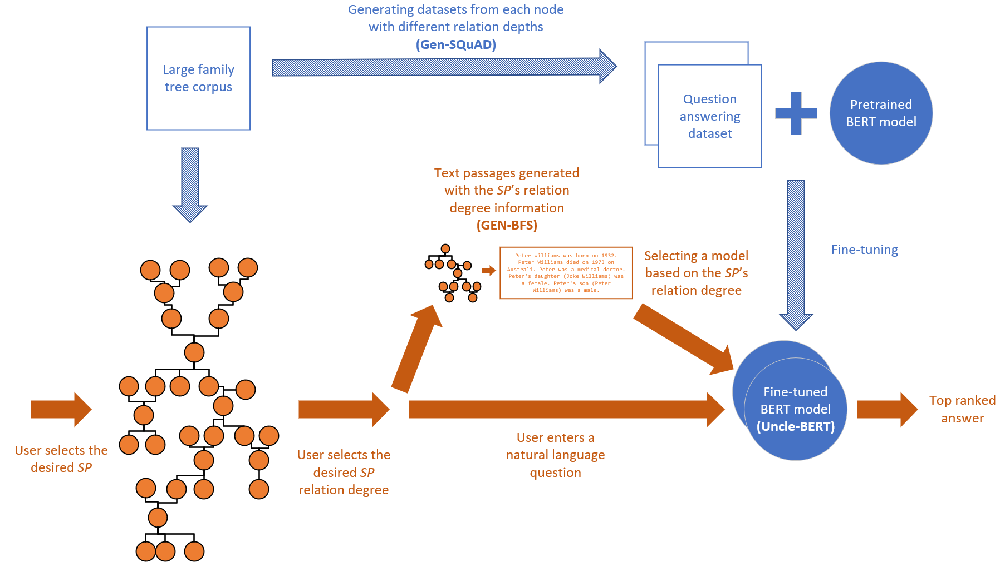

# Uncle-BERT
This repository contains code and models for the paper: [Question Answering with Deep Neural Networks for Semi-Structured Heterogeneous Genealogical Knowledge Graphs](http://www.semantic-web-journal.net/content/question-answering-deep-neural-networks-semi-structured-heterogeneous-genealogical-knowledge)



## Data Preprocessing (Gen-SQuAD)
First you need to have a some GEDCOM files (.ged).

The code to convert GEDCOM files to the Gen-SQuAD dataset will be released after the paper's approval.

## Fine tuning (Uncle-BERT)
Trainig script can be found on training\train_eval_script.py
### Usage

```
python train_eval_script.py 
--model_type bert 
--model_name_or_path bert-base-uncased 
--do_train 
--do_eval 
--dataset_folder /home/Gen_SQuAD_2   
--per_gpu_train_batch_size 8   
--per_gpu_eval_batch_size 8   
--learning_rate 3e-5   
--num_train_epochs 20   
--max_seq_length 512   
--doc_stride 128   
--output_dir /home/Uncle_BERT_2 
--overwrite_output_dir 
--save_steps 5000 
--threads 16 
--evaluate_during_training 
--eval_all_checkpoints 
--max_test_examples 512 
--max_train_examples 131072 
--verbose 
--split_dataset
```
**Note:**

--model_name_or_path can be also set to other models pretrained for SQuAD

--do_train can be removed if only eval is needed

--do_eval can be removed if only training is needed

--dataset_folder should contains the preprocessing output (Gen-SQuAD)

Other parameters are self-explanatory.


## Citation
```
    @TBD
```
