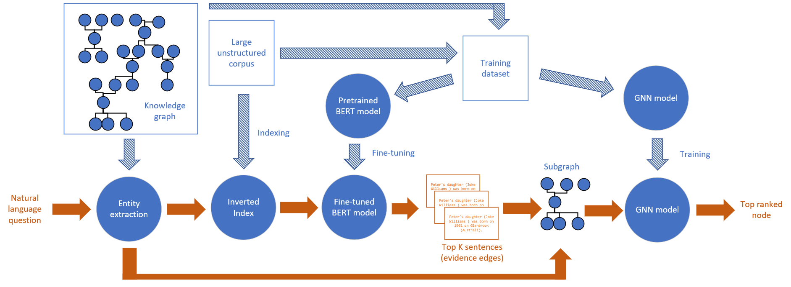

# Uncle-BERT
This repository contains code for the paper: [Question Answering with Deep Neural Networks for Semi-Structured Heterogeneous Genealogical Knowledge Graphs](https://content.iospress.com/articles/semantic-web/sw222925)



## Data Preprocessing (Gen-SQuAD)
1) you need to have some GEDCOM files (.ged). We cannot provide GEDCOM files due to privacy regulations.

2) you can split the GEDCOM files into sub-graphs using the [ged-bfs algorithm (C# pseudo code)](https://github.com/omrishsu/Uncle-BERT/blob/main/ged-bfs/GedBFS/Program.cs).

3) convert GEDCOM files to the Gen-SQuAD dataset (gedcom-texts.py)

4) train and eval (train_eval_script.py) or inference (run_gensquad.py)

## Fine tuning (Uncle-BERT)
Trainig script can be found in [training\train_eval_script.py (python)](https://github.com/omrishsu/Uncle-BERT/blob/main/training/train_eval_script.py)
### Usage

```
python train_eval_script.py 
--model_type bert 
--model_name_or_path bert-base-uncased 
--do_train 
--do_eval 
--dataset_folder /home/Gen_SQuAD_2   
--per_gpu_train_batch_size 8   
--per_gpu_eval_batch_size 8   
--learning_rate 3e-5   
--num_train_epochs 20   
--max_seq_length 512   
--doc_stride 128   
--output_dir /home/Uncle_BERT_2 
--overwrite_output_dir 
--save_steps 5000 
--threads 16 
--evaluate_during_training 
--eval_all_checkpoints 
--max_test_examples 512 
--max_train_examples 131072 
--verbose 
--split_dataset
```
**Note:**

--model_name_or_path can be also set to other models pretrained for SQuAD

--do_train can be removed if only eval is needed

--do_eval can be removed if only training is needed

--dataset_folder should contains the preprocessing output (Gen-SQuAD)

Other parameters are self-explanatory.


## Citation
```
    Suissa, O., Zhitomirsky-Geffet, M., & Elmalech, A. (2023). Question answering with deep neural networks for semi-structured heterogeneous genealogical knowledge graphs. Semantic Web, 14(2), 209-237.
```
